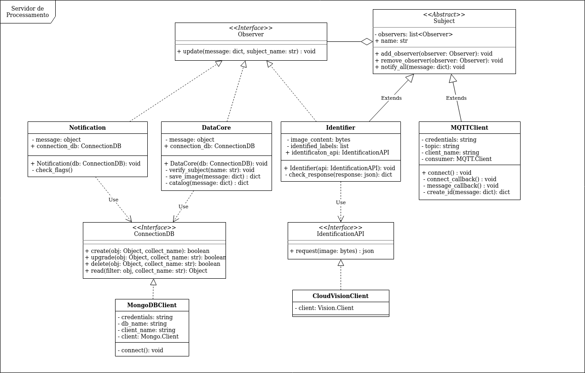

# Modelagem do Sistema
> Este documento contém informações e diagramas da modelagem do sistema.

**Índice**

1. [Diagramas de Classes](#1-diagramas-de-classes)
2. [Formato das Mensagens](#2-formato-das-mensagens)

---

## 1. Diagramas de Classes

### Módulo

### Servidor



---

## 2. Fomato das Mensagens

### Mensagem de Captura

A mensagem enviada do Módulo para o Servidor com informações da captura DEVE possuir o seguinte formato.

```json
{
   "id":"String contendo identificador do Módulo",
   "image":"imagem convertida em bytes",
   "temperatura":"float com valor da temperatura em ºC",
   "umidade":"float com valor da umidade relativa em %",
   "localização":{
      "latitude":"String",
      "longitude":"String"
   },
   "data_captura":"String contendo data e hora da captura"
}
```

